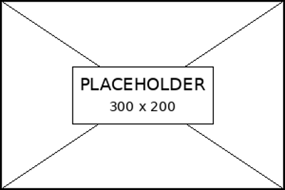

# Document Control

| Field | Value |
|---|---|
| Document ID | SYS-DD-001 |
| Revision | 1.0 |
| Status | Approved |
| Date | 2026-08-20 |
| Author | Engineering Documentation Team |
| Organization | Example Corporation |

# Lists

- Level 1 bullet
  - Level 2 bullet
    - Level 3 bullet

1. First numbered item
2. Second numbered item
   1. Nested numbered item

# Table

| Parameter | Description | Default |
|---|---|---|
| Timeout | Timeout ト。This cell intentionally contains a long description that should wrap naturally inside the table cell. | 30 s |
| Retry | Retry count。<br>Line one<br>Line two. | 3 |
| `configPath` | `C:\Program Files\Example\config.yaml` | system default |

: Table Caption {#tbl:table-sample}

| Parameter | Description | Default |
|---|---|---|
| `page_split_01` | Long table row sample 01.<br>This intentionally long cell validates wrapping and page split behavior. | 1 |
| `page_split_02` | Long table row sample 02.<br>This intentionally long cell validates wrapping and page split behavior. | 2 |
| `page_split_03` | Long table row sample 03.<br>This intentionally long cell validates wrapping and page split behavior. | 3 |
| `page_split_04` | Long table row sample.<br>This intentionally long cell validates wrapping and page split behavior. | 4 |
| `page_split_05` | Long table row sample 05.<br>This intentionally long cell validates wrapping and page split behavior. | 5 |
| `page_split_06` | Long table row sample 06.<br>This intentionally long cell validates wrapping and page split behavior. | 6 |
| `page_split_07` | Long table row sample 07.<br>This intentionally long cell validates wrapping and page split behavior. | 7 |
| `page_split_08` | Long table row sample 08.<br>This intentionally long cell validates wrapping and page split behavior. | 8 |
| `page_split_09` | Long table row sample 09.<br>This intentionally long cell validates wrapping and page split behavior. | 9 |
| `page_split_10` | Long table row sample 10.<br>This intentionally long cell validates wrapping and page split behavior. | 10 |
| `page_split_11` | Long table row sample 11.<br>This intentionally long cell validates wrapping and page split behavior. | 11 |
| `page_split_12` | Long table row sample 12.<br>This intentionally long cell validates wrapping and page split behavior. | 12 |
| `page_split_13` | Long table row sample 13.<br>This intentionally long cell validates wrapping and page split behavior. | 13 |
| `page_split_14` | Long table row sample 14.<br>This intentionally long cell validates wrapping and page split behavior. | 14 |
| `page_split_15` | Long table row sample 15.<br>This intentionally long cell validates wrapping and page split behavior. | 15 |
| `page_split_16` | Long table row sample 16.<br>This intentionally long cell validates wrapping and page split behavior. | 16 |
| `page_split_17` | Long table row sample 17.<br>This intentionally long cell validates wrapping and page split behavior. | 17 |
| `page_split_18` | Long table row sample 18.<br>This intentionally long cell validates wrapping and page split behavior. | 18 |
| `page_split_19` | Long table row sample 19.<br>This intentionally long cell validates wrapping and page split behavior. | 19 |
| `page_split_20` | Long table row sample 20.<br>This intentionally long cell validates wrapping and page split behavior. | 20 |

# Code

Inline Code: `example_function()` and `C:\Program Files\Example\config.yaml`.

**Code 1　Source Code Sample**

```javascript
function example() {
  const configPath = "C:\\Program Files\\Example\\config.yaml";
  return configPath.length > 0;
}
```

# Figure And Caption

{#fig:figure-sample width=120px height=80px}

# Footnotes And Links

See [Pandoc](https://pandoc.org/) for reference-doc behavior.

# TOC Levels

## Heading 2

### Heading 3

#### Heading 4

##### Heading 5

###### Heading 6

# Equation

$$
E = mc^2
$$

# Definition List

**Timeout**
Request timeout in seconds.

**Retry**
Retry count before failing.

# Notes

::: {custom-style="Note / 注記"}
**NOTE:** Provides supplementary information and reference details.
:::

::: {custom-style="Tip / ヒント"}
**TIP:** Provides recommendations for improving work efficiency.
:::

::: {custom-style="Important / 重要"}
**IMPORTANT:** Provides important information that must be reviewed.
:::

::: {custom-style="Warning / 警告"}
**WARNING:** Provides information about conditions that may result in serious failures or losses.
:::

::: {custom-style="Caution / 注意"}
**CAUTION:** Provides operational precautions and information about minor risks.
:::

# Appendix A

## Chapter Title

### Section Title

Appendix body text sample.
